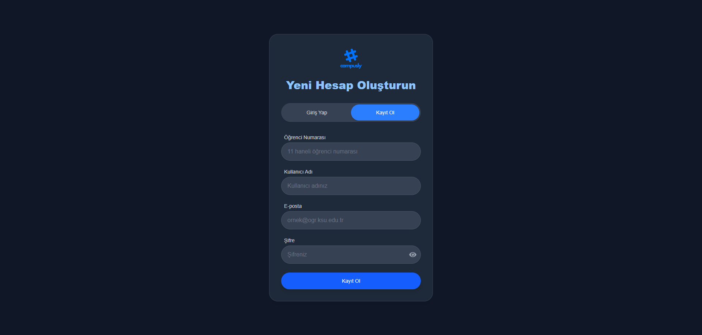
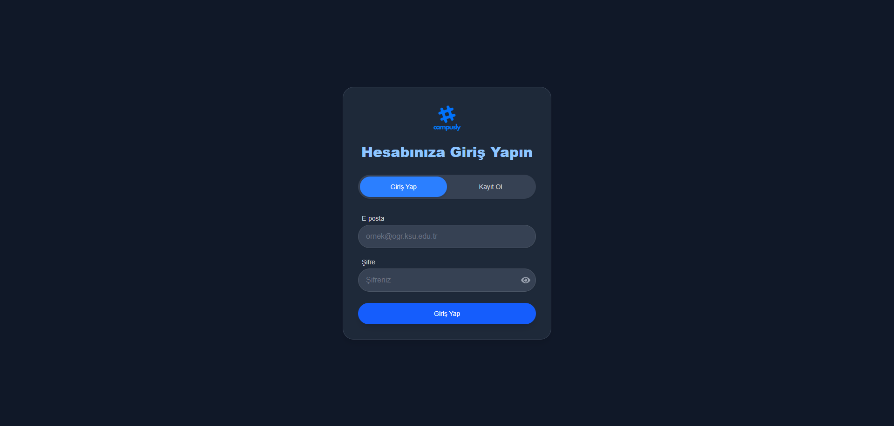
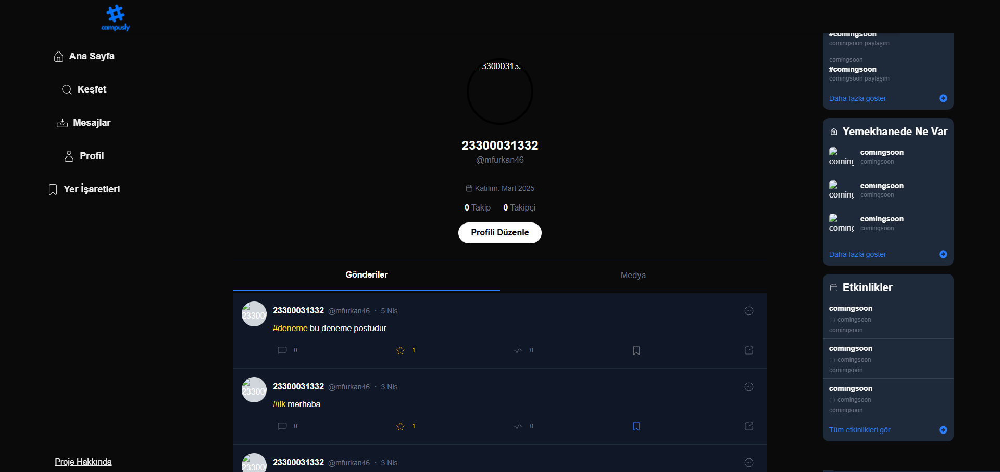
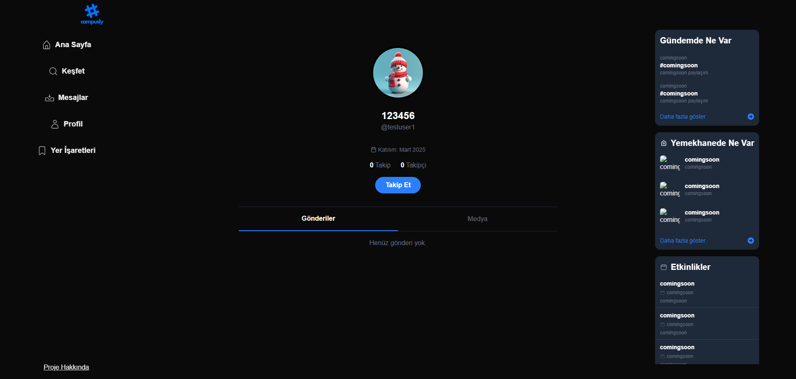
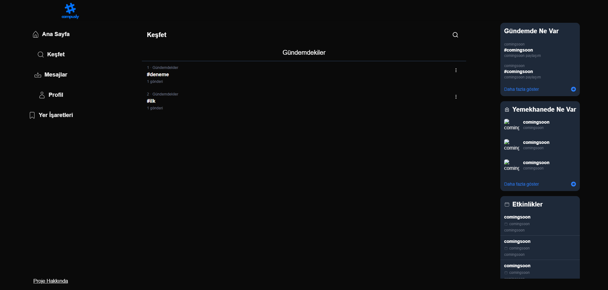
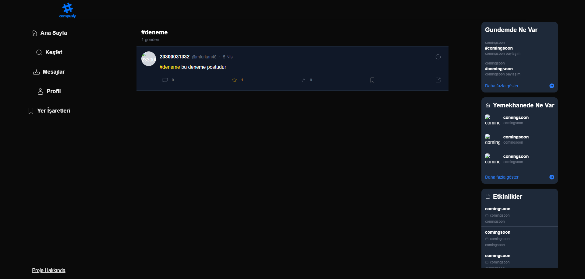

# 🎓 campusly

campusly, Kahramanmaraş Sütçü İmam Üniversitesi öğrencileri için özel olarak geliştirilmiş modern bir sosyal medya platformudur. Öğrenciler arasında etkileşimi artırmayı, bilgi paylaşımını kolaylaştırmayı ve üniversite yaşamını daha sosyal hale getirmeyi hedefler.


## 🧠 Amaç

Bu platform, yalnızca KSÜ öğrencilerinin katılabildiği güvenli ve özel bir sosyal ortam sunar. Uygulama sayesinde öğrenciler birbirleriyle iletişim kurabilir, gönderiler paylaşabilir ve kampüsle ilgili gelişmeleri takip edebilirler.


## 🛠️ Kullanılan Teknolojiler

### Frontend (📁 `frontend/`)
- [Next.js](https://nextjs.org/)
- [Tailwind CSS](https://tailwindcss.com/)
- Responsive mobil uyumlu tasarım

### Backend (📁 `backend/`)
- [Express.js](https://expressjs.com/)
- Katmanlı Mimari: HTTP isteklerini yönlendiren **Routes**, iş mantığını yöneten **Controllers** ve veritabanı işlemlerini gerçekleştiren **Services** katmanlarından oluşur.   
- [Prisma ORM](https://www.prisma.io/)
- [PostgreSQL](https://www.postgresql.org/)


## 📁 Proje Yapısı

```bash
campusly/
├── frontend/   # Kullanıcı arayüzü (Next.js)
└── backend/    # API ve sunucu işlemleri (Express.js)
```

---

## 🖼️ Uygulama Görselleri

Uygulama yalnızca KSÜ öğrencilerine özeldir ve içerik sadece giriş yapan kullanıcılar tarafından görüntülenebilir. Aşağıda uygulamaya ait bazı bölümleri inceleyebilirsiniz:

### 🔐 Kayıt Sayfası

  
➡️ *Sadece geçerli öğrenci numarasıyla kayıt olunur. Güvenli ve basit arayüz.*

---
### 🔐 Giriş Sayfası

  
➡️ *Sadece geçerli öğrenci numarasıyla giriş yapılır. Güvenli ve basit arayüz.*

---

### 📰 Ana Akış Sayfası

  
➡️ *Gönderilerin kronolojik veya algoritmik sıralamayla görüntülendiği ana sayfa.*

---

### 🙍‍♂️ Profil Sayfası

  
➡️ *Kullanıcı bilgileri, gönderiler ve bu sayfada yer alır.*

---
### 🙍‍♂️ Diğer Kullanıcı Sayfası

  
➡️ *Kullanıcı bilgileri, gönderiler ve bu sayfada yer alır.*

---

### 🔍 Keşfet & Etkinlikler (Yakında)

 
 
➡️ *Üniversite etkinliklerini keşfetmeye ve kampüs gündemini takip etmeye yönelik özel alan.*

> 📌 *Görseller zamanla güncellenecektir. Daha fazla ekran görüntüsü eklenecektir.*


## 🚧 Yakında Eklenecek Özellikler

- [ ] **Yemekhane Menüsü** – Günlük yemek listesinin gösterimi
- [ ] **Etkinlik Sayfası** – Kampüs etkinliklerinin duyurulması
- [ ] **Postlara Yorum** – Gönderilere yapılan yorumlar
- [ ] **Profil Düzenleme** – Kullanıcı bilgilerini güncelleme imkanı
- [ ] **Yer İşaretleri** – Gönderileri kaydetme özelliği
- [ ] **Hata Mesajları ve Bildirimler** – Kullanıcı deneyimi artırıcı yapılar
- [ ] **Animasyonlar** – Akıcı geçişler ve geri bildirimler
- [ ] **Akış Algoritması İyileştirmesi** – Kullanıcıya özel gönderi sıralaması
- [ ] **Görüntülenme Sistemi** – Gönderi izlenme sayılarının takibi
- [ ] **Mobil Alt Menü Düzenlemesi** – Mobil uyumlu gezinme deneyimi


## 🔐 Erişim Kuralları

> **Not:** Bu uygulama yalnızca KSÜ öğrencilerine özeldir.

- 📌 **Kayıt için öğrenci numarası zorunludur.**
- 👁️ **Kayıt olmayan kullanıcılar yalnızca giriş ekranını görebilir.**
- 🔒 **Veriler ve içerikler sadece oturum açmış kullanıcılar tarafından görüntülenebilir.**


## 👨‍💻 Geliştirici

**Bu proje, Kahramanmaraş Sütçü İmam Üniversitesi - Bilgisayar Programcılığı** bölümü **Bitirme Projesi** kapsamında bireysel olarak geliştirilmiştir.

**Geliştirici Bilgileri:**

- **👤 Ad Soyad:** *Muhammed Furkan Demirci*
- **🎓 Okul:** Kahramanmaraş Sütçü İmam Üniversitesi
- **📬 Mail:** *muhammednur2004@gmail.com*
- **💼 LinkedIn:** [Furkan Demirci](www.linkedin.com/in/furkan-demirci46)
- **🐙 GitHub:** [mfurkan46](https://github.com/mfurkan46)

> 📬 Bana ulaşmak isterseniz yukarıdaki adreslerden iletişime geçebilirsiniz!


## 💬 Katkı ve Geri Bildirim

Proje bireysel bir çalışma olsa da, fikir ve önerilere her zaman açığım.  
Görüşlerinizi paylaşmak için bir `issue` oluşturabilir veya doğrudan iletişime geçebilirsiniz.


## 📝 Not

> Bu proje **Kahramanmaraş Sütçü İmam Üniversitesi - Bilgisayar Programcılığı** bölümü öğrencisi tarafından **bitirme projesi** olarak geliştirilmiştir.  
> Tüm hakları saklıdır.
